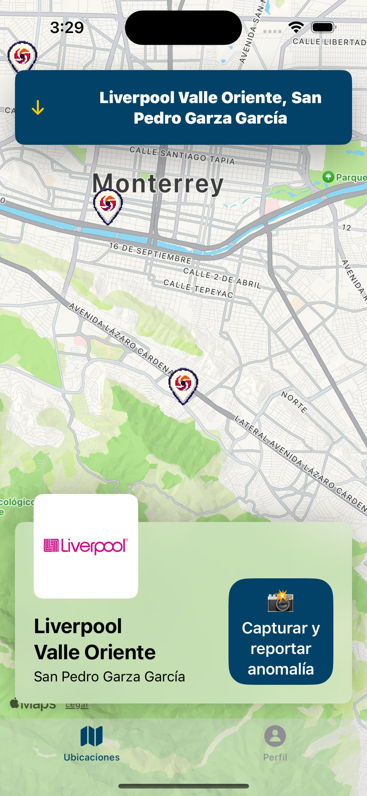
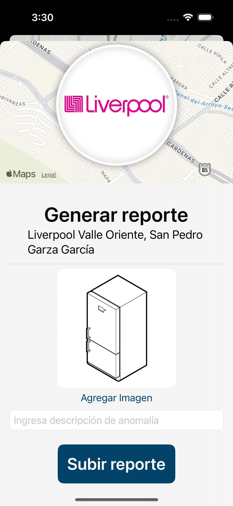
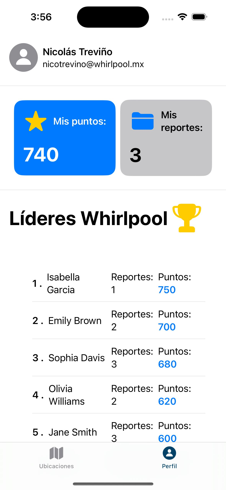

# Pool Pool Go iOS App (SwiftUI)

    

        
        
Real Time Store Map

    

    

        
        
Reporting Screen

    

    

        
        
App Leaderboard

    

This repository contains the Swift/SwiftUI code for the iOS app component of Pool Pool Go, Whirlpool's anomaly reporting system. The app enables employees to quickly report anomalies from their iPhones and iPads, with data securely stored in an Oracle Cloud SQL database for efficient management via an external admin web dashboard.

## Features

* **User-Friendly Interface:** Easily report anomalies with a streamlined interface.
* **Detailed Reporting:** Capture location, description, photos, and other relevant data.
* **Real-time Reporting:** Reports are instantly transmitted to the Oracle SQL database.
* **Offline Mode:** Save reports offline and seamlessly sync when a connection is available.
* **Notifications:** Receive updates on the status of your submitted reports.

## Installation

1. **Clone this repository:** `git clone https://github.com/your-username/pool-pool-go-ios.git`
2. **Open the project in Xcode:** `open PoolPoolGo.xcodeproj`
3. **Configure Database Connection:** Update the app's configuration with your Oracle Cloud SQL database credentials.
4. **Build and run:** Hit the play button in Xcode to build and run the app on a simulator or device.

## Dependencies

* **SwiftUI:** Apple's declarative UI framework.
* **(Networking Library):** A library for handling communication with the Oracle Cloud SQL database (e.g., Alamofire, URLSession).

## Project Structure

* **Views:** SwiftUI views for the app's UI.
* **Models:** Data models for anomalies and report data.
* **ViewModels:** Logic for managing views and data interactions.
* **Services:** Networking layer for interacting with the Oracle Cloud SQL database.

## Integration with Admin Dashboard

Reports submitted through the iOS app are immediately accessible on the Pool Pool Go admin web dashboard, facilitating efficient anomaly management and analysis.

## Contributing

We welcome contributions to the Pool Pool Go iOS app! Please follow these steps:

1. Fork the repository.
2. Create a new branch for your feature/bug fix.
3. Make your changes and commit them.
4. Push your changes to your fork.
5. Submit a pull request.

## Team

This app was developed by Ramiro Garza as part of the Pool Pool Go project team at Tec de Monterrey, and was named one of the top three projects.

## Acknowledgments

A special thanks Whirlpool Corporation for giving us the opportunity to work on this exciting project.

## License

This project is licensed under the [MIT License](LICENSE).
